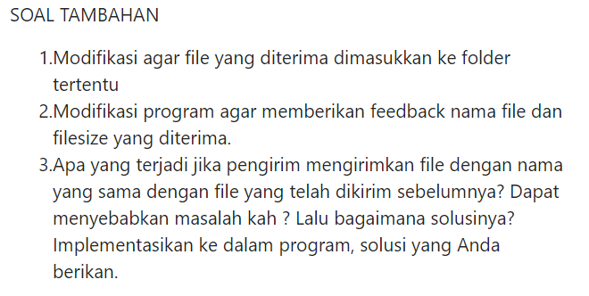

<a href="https://git.io/typing-svg"></a>
```
Nama : Ali Rafli Putra Hakiki
NIM : 1203220107
Kelas : IF-02-01
```

<hr>

SOAL

1. Buat sebuah program file transfer protocol menggunakan socket programming dengan beberapa perintah dari client seperti berikut:
- `connme` : Untuk melakukan hubungan ke server.
- `ls` : ketika client menginputkan command tersebut, maka server akan menampilkan daftar folder dan file dalam folder.
- `rm {nama file}` : ketika client menginputkan command tersebut, maka server akan menghapus file.
- `download {nama file}` : ketika client menginputkan command tersebut, maka server akan memberikan dan menampilkan isi file.
- `upload {nama file}` : ketika client menginputkan command tersebut, maka server akan menerima dan menyimpan file.
- `size {nama file}` : ketika client menginputkan command tersebut, maka server akan memberikan informasi file dalam satuan MB (Mega bytes) sesuai nama file.
- `byebye` : ketika client menginputkan command tersebut, hubungan server-client akan diputus.

<br>

### Code Program : Server 
    import socket
    import sys
    import time
    import os
    import struct
    
    print("\nWelcome!!.\n\nWaiting for client connection...\n\n")
    
    TCP_IP = "127.0.0.1"
    TCP_PORT = 8080
    BUFFER_SIZE = 1024
    s = socket.socket(socket.AF_INET, socket.SOCK_STREAM)
    s.bind((TCP_IP, TCP_PORT))
    s.listen(1)
    conn, addr = s.accept()
    
    print("\n Connected with address : {}".format(addr))
    
    def upld():
        conn.send(b"1")
        file_name_length = struct.unpack("h", conn.recv(2))[0]
        file_name = conn.recv(file_name_length).decode()
    
        original_file_name = file_name
        counter = 1
        while os.path.exists(file_name):
            file_name = f"{os.path.splitext(original_file_name)[0]}_{counter}{os.path.splitext(original_file_name)[1]}"
            counter += 1
    
        conn.send(b"1")
        file_size = struct.unpack("i", conn.recv(4))[0]
        start_time = time.time()
        print(f"Receiving file: {file_name}")
        content = open(file_name, "wb")
        l = conn.recv(BUFFER_SIZE)
        while l:
            content.write(l)
            l = conn.recv(BUFFER_SIZE)
        content.close()
        conn.send(struct.pack("f", time.time() - start_time))
        conn.send(struct.pack("i", file_size))
        print("File received successfully")
        return
    
    def list_files():
        print("Listing files...")
        listing = os.listdir(os.getcwd())
        conn.send(struct.pack("i", len(listing)))
        total_directory_size = 0
        for i in listing:
            conn.send(struct.pack("i", sys.getsizeof(i)))
            conn.send(i.encode())
            conn.send(struct.pack("i", os.path.getsize(i)))
            total_directory_size += os.path.getsize(i)
            conn.recv(BUFFER_SIZE)
        conn.send(struct.pack("i", total_directory_size))
        conn.recv(BUFFER_SIZE)
        print("Successfully sent file listing")
        return
    
    def dwld():
        conn.send(b"1")
        file_name_length = struct.unpack("h", conn.recv(2))[0]
        file_name = conn.recv(file_name_length).decode()
        if os.path.isfile(file_name):
            conn.send(struct.pack("i", os.path.getsize(file_name)))
        else:
            print("File name not valid")
            conn.send(struct.pack("i", -1))
            return
        conn.recv(BUFFER_SIZE)
        start_time = time.time()
        print("Sending file...")
        content = open(file_name, "rb")
        l = content.read(BUFFER_SIZE)
        while l:
            conn.send(l)
            l = content.read(BUFFER_SIZE)
        content.close()
        conn.recv(BUFFER_SIZE)
        conn.send(struct.pack("f", time.time() - start_time))
        print("File sent successfully")
        return
    
    def delf():
        conn.send(b"1")
        file_name_length = struct.unpack("h", conn.recv(2))[0]
        file_name = conn.recv(file_name_length).decode()
        if os.path.isfile(file_name):
            conn.send(struct.pack("i", 1))
        else:
            conn.send(struct.pack("i", -1))
        confirm_delete = conn.recv(BUFFER_SIZE).decode()
        if confirm_delete == "Y":
            try:
                os.remove(file_name)
                conn.send(struct.pack("i", 1))
            except:
                print("Failed to delete {}".format(file_name))
                conn.send(struct.pack("i", -1))
        else:
            print("Deleted!")
            return
    
    def get_file_size():
        conn.send(b"1")
        file_name_length = struct.unpack("h", conn.recv(2))[0]
        file_name = conn.recv(file_name_length).decode()
        if os.path.isfile(file_name):
            conn.send(struct.pack("i", os.path.getsize(file_name)))
        else:
            conn.send(struct.pack("i", -1))
        return
    
    def quit():
        conn.send(b"1")
        conn.close()
        s.close()
        os.execl(sys.executable, sys.executable, *sys.argv)
    
    while True:
        data = conn.recv(BUFFER_SIZE).decode()
        print("\nReceived instruction: {}".format(data))
        if data == "upload":
            upld()
        elif data == "ls":
            list_files()
        elif data == "download":
            dwld()
        elif data == "rm":
            delf()
        elif data == "size":
            get_file_size()
        elif data == "byebye":
            quit()
        data = None
<br>

### Penjelasan :
    
- Import Library: Program ini mengimpor beberapa modul yang diperlukan, yaitu socket, os, dan configparser. 
<br>
    
- Variabel Konfigurasi: BUFFER_SIZE didefinisikan sebagai ukuran buffer yang digunakan untuk mengirim dan menerima data. Nilainya adalah 1024 byte.
<br>

- Fungsi handle_client: Ini adalah fungsi yang menangani koneksi dari klien. Ini menerima perintah dari klien, memprosesnya, dan memberikan respons sesuai. Struktur if-elif-else digunakan untuk menangani beberapa jenis perintah yang berbeda:
        ls: Membaca daftar file di direktori saat ini dan mengirimkan daftar tersebut kembali ke klien.
        size [filename]: Mengembalikan ukuran file yang diminta kepada klien.
        upload [filename]: Menerima data file dari klien dan menyimpannya di server dengan nama file yang diberikan.
        download [filename]: Mengirimkan file yang diminta kepada klien.
        rm [filename]: Menghapus file yang diminta dari server.
        byebye: Menutup koneksi dengan klien.
<br>

- Fungsi main :
      Ini adalah fungsi utama dari program server. Ini membaca konfigurasi server dari file server_config.ini, mengikat socket server ke alamat dan port yang ditentukan, dan mulai mendengarkan koneksi masuk. Ketika koneksi diterima, ia menerima klien baru dan menangani permintaan klien dengan memanggil fungsi handle_client.
<br>

- Baca Konfigurasi Server :
      Konfigurasi server dibaca dari file server_config.ini menggunakan configparser. Konfigurasi mencakup host dan port yang digunakan oleh server.
<br>

- Membuat Socket Server :
  Server membuat socket menggunakan socket.socket() dengan alamat IPv4 dan jenis socket TCP (socket.AF_INET dan socket.SOCK_STREAM). Kemudian socket 
  tersebut diikat ke alamat dan port yang diberikan.
<br>

- Mendengarkan Koneksi Masuk :
  Server memulai mendengarkan koneksi masuk dengan memanggil server_socket.listen(). Ini menunggu dan menerima koneksi dari klien dengan server_socket.accept().
<br>

- Mengelola Koneksi:
  Ketika koneksi diterima, server memanggil handle_client untuk menangani koneksi dari klien tersebut. Setelah selesai, server kembali ke tahap mendengarkan koneksi masuk.
<br>

### Code Program : Client
    import socket
    import sys
    import os
    import struct
    import time
    
    TCP_IP = "127.0.0.1"
    TCP_PORT = 8080
    BUFFER_SIZE = 1024
    s = socket.socket(socket.AF_INET, socket.SOCK_STREAM)
    
    
    print("\n------------------------------------")
    print("Python FTP Socket Programming")
    print("-------------------------------------")
    print("Choose Command:")
    print("connme                :(use this first to connect to current server)")
    print("ls                    : List of files")
    print("size <file_path>      : file sizes")
    print("upload <file_path>    : Upload files")
    print("download <file_path>  : Download files")
    print("rm <file_path>        : Remove files")
    print("byebye                : Disconnect.")
    print("-------------------------------------")
    
    
    def connme():
        try:
            s.connect((TCP_IP, TCP_PORT))
            print("Connected!")
        except:
            print("Connection failed! Make sure the port is correct")
    
    def upld(file_name):
        try:
            s.send(b"upload")
        except:
            print("Couldn't make server request. Make sure server connection established")
            return
        try:
            s.recv(BUFFER_SIZE)
            s.send(struct.pack("h", sys.getsizeof(file_name)))
            s.send(file_name.encode())
            file_size = os.path.getsize(file_name)
            s.send(struct.pack("i", file_size))
            start_time = time.time()
            print("Sending file...")
            content = open(file_name, "rb")
            l = content.read(BUFFER_SIZE)
            while l:
                s.send(l)
                l = content.read(BUFFER_SIZE)
            content.close()
            s.recv(BUFFER_SIZE)
            s.send(struct.pack("f", time.time() - start_time))
            print("File sent successfully")
            return
        except:
            print("Error sending file")
            return
    
    def list_files():
        try:
            s.send(b"ls")
        except:
            print("Couldn't make server request. Make sure server connection established.")
            return
        try:
            number_of_files = struct.unpack("i", s.recv(4))[0]
            for i in range(int(number_of_files)):
                file_name_size = struct.unpack("i", s.recv(4))[0]
                file_name = s.recv(file_name_size).decode()
                file_size = struct.unpack("i", s.recv(4))[0]
                print("\t{} - {}b".format(file_name, file_size))
                s.send(b"1")
            total_directory_size = struct.unpack("i", s.recv(4))[0]
            print("Total directory size: {}b".format(total_directory_size))
        except:
            print("Couldn't retrieve listing")
            return
        try:
            s.send(b"1")
            return
        except:
            print("Couldn't get final server confirmation")
            return
    
    def dwld(file_name):
        try:
            s.send(b"download")
        except:
            print("Couldn't make server request. Make sure server connection established.")
            return
        try:
            s.recv(BUFFER_SIZE)
            s.send(struct.pack("h", sys.getsizeof(file_name)))
            s.send(file_name.encode())
            file_size = struct.unpack("i", s.recv(4))[0]
            if file_size == -1:
                print("File does not exist. Make sure the name was entered correctly")
                return
        except:
            print("Error checking file")
        try:
            s.send(b"1")
            output_file = open(file_name, "wb")
            bytes_received = 0
            print("\nDownloading...")
            while bytes_received < file_size:
                l = s.recv(BUFFER_SIZE)
                output_file.write(l)
                bytes_received += BUFFER_SIZE
            output_file.close()
            print("Successfully downloaded {}".format(file_name))
            s.send(b"1")
            print("\nFile size: {}b".format(file_size))
        except:
            print("Error downloading file")
            return
        return
    
    def delf(file_name):
        try:
            s.send(b"rm")
            s.recv(BUFFER_SIZE)
        except:
            print("Couldn't connect to server. Make sure server connection established.")
            return
        try:
            s.send(struct.pack("h", sys.getsizeof(file_name)))
            s.send(file_name.encode())
        except:
            print("Couldn't send file details")
            return
        try:
            file_exists = struct.unpack("i", s.recv(4))[0]
            if file_exists == -1:
                print("The file does not exist on server")
                return
        except:
            print("Couldn't determine file existence")
            return
        try:
            confirm_delete = input("Are you sure you want to delete {}? (Y/N)\n".format(file_name)).upper()
            while confirm_delete != "Y" and confirm_delete != "N" and confirm_delete != "YES" and confirm_delete != "NO":
                print("Command not recognized, try again")
                confirm_delete = input("Are you sure you want to delete {}? (Y/N)\n".format(file_name)).upper()
        except:
            print("Couldn't confirm deletion status")
            return
        try:
            if confirm_delete == "Y" or confirm_delete == "YES":
                s.send(b"Y")
                delete_status = struct.unpack("i", s.recv(4))[0]
                if delete_status == 1:
                    print("Successfully deleted")
                    return
                else:
                    print("File failed to delete")
                    return
            else:
                s.send(b"N")
                print("Delete canceled!")
                return
        except:
            print("Couldn't delete file")
            return
    
    def get_file_size(file_name):
        try:
            s.send(b"size")
        except:
            print("Couldn't make server request. Make sure server connection established.")
            return
        try:
            s.recv(BUFFER_SIZE)
            s.send(struct.pack("h", sys.getsizeof(file_name)))
            s.send(file_name.encode())
            file_size = struct.unpack("i", s.recv(4))[0]
            if file_size == -1:
                print("File does not exist. Make sure the name was entered correctly")
                return
        except:
            print("Error checking file")
        try:
            s.send(b"1")
            print("File size: {} MB".format(file_size / 1024 / 1024))
            return
        except:
            print("Couldn't get final server confirmation")
            return
    
    def quit():
        s.send(b"byebye")
        s.recv(BUFFER_SIZE)
        s.close()
        print("Server connection ended")
        return
    
    while True:
        prompt = input("\nPlease Enter Your Command! : ")
        if prompt[:6].lower() == "connme":
            connme()
        elif prompt[:6].lower() == "upload":
            upld(prompt[7:])
        elif prompt.lower() == "ls":
            list_files()
        elif prompt[:8].lower() == "download":
            dwld(prompt[9:])
        elif prompt[:2].lower() == "rm":
            delf(prompt[3:])
        elif prompt[:4].lower() == "size":
            get_file_size(prompt[5:])
        elif prompt.lower() == "byebye":
            quit()
            break
        else:
            print("Cant find the asked Command; Please check again!")

<br>

### Penjelasan :
- Variabel Konfigurasi :
        SERVER_HOST: Alamat IP server yang akan dikoneksikan oleh klien. Dalam contoh ini, diatur ke '127.0.0.1', yang merupakan localhost.
        SERVER_PORT: Port yang digunakan oleh server untuk menerima koneksi dari klien. Dalam contoh ini, diatur ke 12345.
        BUFFER_SIZE: Ukuran buffer untuk mengirim dan menerima data antara klien dan server.
<br>

- Fungsi main :
        Fungsi utama program yang akan dieksekusi saat menjalankan program.
        Mencetak pesan selamat datang dan daftar perintah yang dapat digunakan oleh pengguna.
        Membuat socket klien menggunakan socket.socket() dengan alamat IPv4 dan jenis socket TCP (socket.AF_INET dan socket.SOCK_STREAM).
        Menghubungkan klien ke server menggunakan client_socket.connect((SERVER_HOST, SERVER_PORT)).

<br>

- Loop Utama :
        Program masuk ke dalam loop utama yang berjalan selama koneksi dengan server aktif.
        Pengguna diminta untuk memasukkan perintah menggunakan input().
        Perintah yang dimasukkan oleh pengguna dikirimkan ke server menggunakan client_socket.send(command.encode()).

<br>

- Penanganan Perintah "byebye" :
        Jika pengguna memasukkan perintah "byebye", klien mengirimkan perintah ke server dan mencetak pesan sebelum memutus koneksi.
        Klien menerima respons dari server dan mencetak pesan penutupan sebelum keluar dari loop dan menutup koneksi dengan server.
<br>

- Menerima Respons dari Server:
        Setelah mengirim perintah ke server, klien menerima respons dari server menggunakan client_socket.recv(BUFFER_SIZE).
        Data yang diterima kemudian didekode dari byte menjadi string menggunakan .decode() untuk membaca pesan respons dari server.
        Jika respons adalah "Command not found", klien mencetak pesan kesalahan.
        Jika respons adalah respons dari perintah yang dijalankan, klien mencetak respons tersebut.
<br>

### Cara Kerja Program :

- Server Program:
        Program server membuat sebuah socket dan mulai mendengarkan koneksi masuk.
        Ketika koneksi diterima dari klien, server menerima perintah dari klien.
        Server memproses perintah tersebut dan memberikan respons yang sesuai kepada klien.
        Koneksi antara klien dan server tetap terbuka sampai klien mengirimkan perintah "byebye" untuk menutup koneksi.

<br>

- Klien Program:
        Program klien membuat sebuah socket dan terhubung ke alamat dan port yang telah ditentukan oleh server.
        Pengguna diminta untuk memasukkan perintah dari daftar perintah yang tersedia.
        Klien mengirimkan perintah yang dimasukkan oleh pengguna ke server melalui socket.
        Klien menerima respons dari server dan mencetaknya.
        Loop ini berlanjut sampai pengguna memasukkan perintah "byebye" untuk keluar dari program.

<br>


### Kesimpulan : 

- Fungsionalitas dasar kedua program diatas adalah untuk berkomunikasi antara klien dan server melalui protokol FTP menggunakan socket. program diatas memberikan pengguna           antarmuka sederhana untuk melakukan operasi dasar pada file di server, seperti melihat daftar file, mengunduh, mengunggah, menghapus, dan menghitung ukuran file.
<br>

### COMMAND LIST :

**1. Ls**
```
Enter Command : ls
```

Perintah `ls` digunakan untuk mengetahui folder dan file yang ada di direktori. Output : 
`client.py`


**2. Size**
```
Enter Command : size <nama_file>
```

Perintah `size` digunakan untuk mengetahui ukuran file yang diinginkan dengan menambahkan parameter nama file. Output : 


**3. Upload**
```
Enter Command : upload <nama_file>
```

Perintah `upload` digunakan untuk mengunggah file yang diinginkan `client` dengan menambahkan nama file, misalnya `DreamAI.py`. File yang diunggah ini akan diterima dan disimpan oleh `server` ke direktori server.

**4. Download**
```
Enter Command : download <nama_file>
```

Perintah `download` digunakan untuk mengunduh file yang diinginkan `client` dengan menambahkan nama file, misalnya `DreamAI.py`. File yang diunduh ini akan berada di `client` dan `client` akan menampilkannya. Output : 


**5. Rm**
```
Enter Command : rm <nama_file>
```

Perintah `rm` digunakan untuk menghapus file yang diinginkan `client`. Output :


**6. Byebye**
```
Enter Command : byebye
```

Perintah `byebye` digunakan untuk memutuskan koneksi antara `client` dengan `server`. Output :


<hr> 


<hr>
UPDATE SOAL : 



